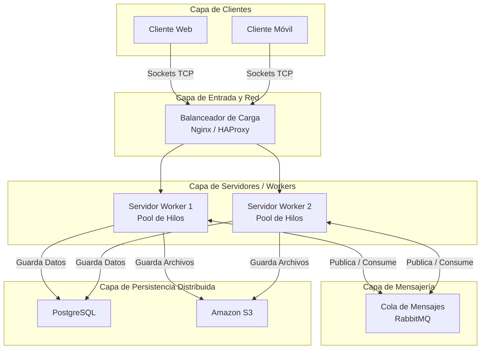

## IFTS 29 - Programación Sobre Redes  
## Práctica Formativa N° 3 - Sistema de Gestión de Tareas con API - Rediseño como sistema distribuido

###  Alumno: Andrea Purriños
###  Comisión: 3A1C26

---

## Descripción de la PFO 3 
Esta entrega transforma el sistema monolítico anterior en una arquitectura distribuida de alta disponibilidad. Se reemplazó el protocolo HTTP y el framework Flask por una comunicación basada en **Sockets TCP nativos**, delegando el procesamiento de datos a un **Pool de Hilos (Workers)** para simular un entorno escalable y asincrónico.

---

## Diagrama de la Arquitectura

