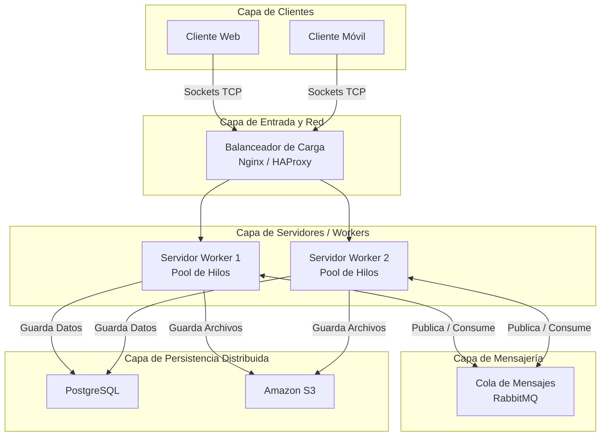
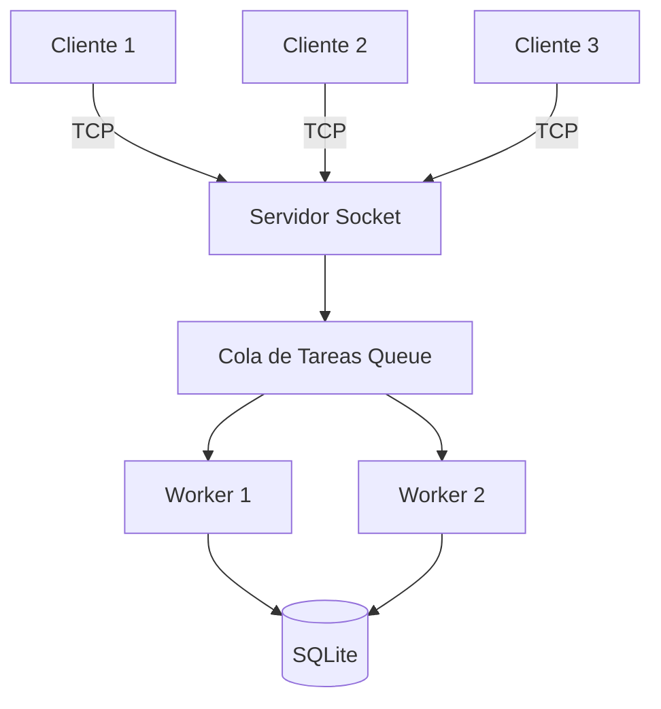

## IFTS 29 - Programación Sobre Redes  
## Práctica Formativa N° 3 - Sistema de Gestión de Tareas - Rediseño como sistema distribuido

###  Alumno: Andrea Purriños
###  Comisión: 3A1C26

---

## Descripción de la PFO 3 
Esta entrega transforma el sistema monolítico anterior en una arquitectura distribuida de alta disponibilidad. Se reemplazó el protocolo HTTP y el framework Flask por una comunicación basada en **Sockets TCP nativos**, delegando el procesamiento de datos a un **Pool de Hilos (Workers)** para simular un entorno escalable y asincrónico.

---

## Arquitectura conceptual (Representa un sistema distribuido real)




## Diagrama de la implementación realizada



## Implementación

La implementación desarrollada en Python simula una arquitectura distribuida utilizando comunicación mediante **Sockets TCP**, una **cola de tareas** y un conjunto de **Workers** ejecutados mediante hilos.

El sistema está compuesto por:

* **Cliente Socket:** envía solicitudes al servidor para crear, consultar o eliminar tareas.
* **Servidor Principal:** recibe las conexiones de los clientes y coloca las solicitudes en una cola de procesamiento.
* **Workers:** consumen tareas desde la cola y ejecutan las operaciones solicitadas.
* **Base de Datos SQLite:** almacena las tareas de forma persistente.

### Flujo de funcionamiento

1. El cliente establece una conexión TCP con el servidor.
2. El servidor recibe la solicitud y la incorpora a una cola de tareas.
3. Un Worker disponible toma la tarea de la cola.
4. El Worker procesa la solicitud correspondiente.
5. El resultado es enviado nuevamente al cliente.
6. Las tareas se almacenan de forma persistente en SQLite.

### Funcionalidades implementadas

* Crear tareas.
* Listar tareas registradas.
* Eliminar tareas.
* Procesamiento concurrente mediante múltiples Workers.
* Atención simultánea de múltiples clientes.
* Persistencia de datos mediante SQLite.

### Tecnologías utilizadas

* Python 3
* Socket TCP
* Threading
* Queue
* SQLite

## Estructura del Proyecto

```text
pfo3-sistema-distribuido/
│
├── cliente.py
├── servidor.py
├── tareas.db
└── README.md
```

## Ejecución

### Iniciar el servidor

```bash
python servidor_socket.py
```

### Ejecutar un cliente

```bash
python cliente_socket.py
```

Se pueden ejecutar múltiples instancias del cliente simultáneamente para verificar el procesamiento concurrente de solicitudes por parte de los Workers.

## Relación con la PFO anterior

En la práctica anterior el sistema utilizaba una arquitectura monolítica basada en Flask y comunicación HTTP.

En esta versión se rediseñó el sistema utilizando una arquitectura distribuida basada en sockets TCP, donde las solicitudes son procesadas por un conjunto de Workers a través de una cola de tareas, simulando el comportamiento de sistemas distribuidos de mayor escala.
